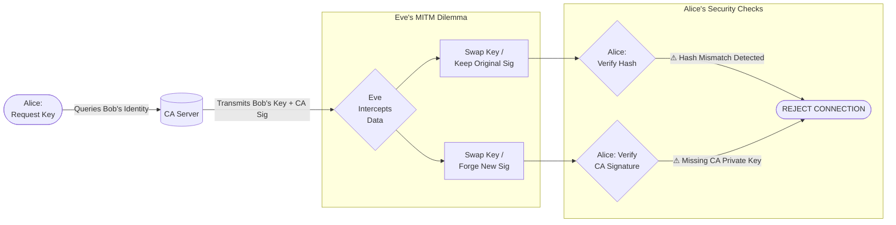

# RSA and Certificate Authority (CA): A Deep Dive

This document explains the cryptographic mechanisms—specifically RSA and Certificate Authorities (CA)—implemented in this project to secure communication between clients (like Alice and Bob) and protect against Man-in-the-Middle (MITM) attacks.

---

## 1. RSA Cryptography: The Foundation

**RSA** (Rivest–Shamir–Adleman) is an asymmetric cryptographic algorithm. "Asymmetric" means it uses two different keys:
*   **Public Key**: Shared with everyone. Used to *encrypt* messages and *verify* signatures.
*   **Private Key**: Kept secret. Used to *decrypt* messages and *create* signatures.

### How it Works (The Math)
The security of RSA relies on the difficulty of factoring large numbers.

#### A. Key Generation
Only the user (or the CA) generates these keys.
*   **Step 1:** Choose two distinct large prime numbers, $p$ and $q$. (Implemented in `crypto_core.py`)
*   **Step 2:** Compute $n = p \times q$. This is the **modulus** for both the public and private keys.
*   **Step 3:** Compute Euler's totient function $\phi(n) = (p-1)(q-1)$.
*   **Step 4:** Choose a public exponent $e$. A standard choice is 65537 ($2^{16} + 1$).
*   **Step 5:** Compute the private exponent $d$ such that $d \equiv e^{-1} \pmod{\phi(n)}$. This is the modular multiplicative inverse.

**Result:**
*   **Public Key**: $(e, n)$
*   **Private Key**: $(d, n)$

#### B. Encryption (Confidentiality)
Alice wants to send a secret message $m$ to Bob. She uses Bob's **Public Key** $(e, n)$.
1.  **Padding:** The message is padded (using PKCS#1 v1.5) to ensure security and randomness.
2.  **Math:** $c = m^e \pmod n$.
3.  **Result:** $c$ is the ciphertext (random-looking numbers).

Only Bob, who has the **Private Key** $d$, can reverse this.

#### C. Decryption
Bob receives ciphertext $c$.
1.  **Math:** $m = c^d \pmod n$.
2.  **Why it works:** Euler's Theorem guarantees that $(m^e)^d \equiv m \pmod n$.
3.  **Result:** Bob recovers the original message $m$.

#### D. Digital Signatures (Authenticity)
To prove a message came from her, Alice "signs" it using her **Private Key**.
1.  **Hash:** Alice creates a "fingerprint" of the data (e.g., using SHA-256). Let's call this hash $H$.
2.  **Sign:** $S = H^d \pmod n$.
3.  **Verify:** Bob (or anyone with Alice's Public Key) computes $H' = S^e \pmod n$. If $H' == H$, the signature is valid.

---

## 2. The Certificate Authority (CA): The Trust Anchor

RSA alone allows encryption, but it has a fatal flaw: **How do you know the public key actually belongs to Bob?**

If an attacker (Eve) sits in the middle, she can give Alice her *own* public key, pretending to be Bob. Alice encrypts secrets for "Bob," but Eve decrypts them.

To solve this, we use a **Certificate Authority (CA)**.

### How the CA Works in This Project

In our system (`secure_server.py`), the **Server acts as the CA**.

#### Phase 1: The Trust Anchor (HELLO)
1.  **Server Startup**: The server generates its own "Master" RSA keypair (CA Keys).
2.  **Client Connection**: When Alice connects (`HELLO`), the server replies (`HELLO_ACK`) with the **CA Public Key**.
3.  **Result**: Alice now trusts the Server. She stores the CA Public Key.

#### Phase 2: Signing Keys (The "Certificate")
When Alice asks for Bob's key, the Server acts as a notary.
1.  **Request**: Alice sends `REQ_KEY Bob`.
2.  **Lookup**: The server finds Bob's public key: $(e_{bob}, n_{bob})$.
3.  **The "Certificate" Payload**: The server creates a specific string to sign:
    `Format: "Bob" + e_{bob} + n_{bob}`
4.  **Signing**:
    *   Hash the payload: $H = \text{SHA256}(\text{payload})$
    *   Sign with CA Private Key: $Signature = H^{d_{CA}} \pmod{n_{CA}}$
5.  **Response**: The server sends Alice:
    *   Bob's Public Key
    *   The **Signature**

#### Phase 3: Client Verification
Alice receives the key and the signature. She doesn't trust the key yet—she trusts the CA.
1.  **Reconstruct**: Alice reconstructs the payload string (`"Bob" + ...`).
2.  **Hash**: She calculates the hash $H$ of this payload.
3.  **Verify Signature**: She uses the **CA Public Key** she stored earlier.
    *   Calculates $H' = Signature^{e_{CA}} \pmod{n_{CA}}$
4.  **Compare**:
    *   **If $H' == H$**: The signature is valid. The CA confirms this IS Bob's key.
    *   **If $H' \neq H$**: **SECURITY ALERT!** The key verifies incorrectly. Currently, someone (Eve) might be tampering with the key.

---

## 3. The "Man-in-the-Middle" (MITM) Attack & Why it Fails
Here is the mathematical breakdown of why an attacker (Eve) cannot break this system without the CA's private key.

### The Scenario
1.  Alice asks the Server for Bob's key: `REQ_KEY Bob`.
2.  The Server sends back: `(Bob_PublicKey, Signature_of_Bob)`.
3.  **Eve intercepts** this packet.

Eve wants to trick Alice into using **Eve's Key** so she can read Alice's messages. She strips out Bob's key and injects her own: `(Eve_PublicKey, ???)`.

Eve has a problem. She needs to send a **Signature** that matches her key. She has two choices:

### Failure Case 1: The Replay Attack (Using Bob's Signature)
Eve is lazy. She sends **Eve's Public Key** paired with **Bob's original Signature**.

*   **Alice Receives**:
    *   Key: $K_{eve} = (e_{eve}, n_{eve})$
    *   Signature: $S_{bob}$ (which is $H(K_{bob})^{d_{CA}} \pmod{N_{CA}}$)

*   **Alice's Verification Logic**:
    *   **Step A (decrypt signature)**: Alice uses CA Public Key to reveal what the signature *claims* is the hash.
        $$H_{claimed} = (S_{bob})^{e_{CA}} \pmod{N_{CA}}$$
        **Result**: $H_{claimed} = \text{Hash}(K_{bob})$

    *   **Step B (hash received key)**: Alice calculates the hash of the key she actually received.
        $$H_{calculated} = \text{Hash}(K_{eve})$$

    *   **Step C (Compare)**:
        $$H_{claimed} \neq H_{calculated}$$
        $$\text{Hash}(K_{bob}) \neq \text{Hash}(K_{eve})$$

*   **Conclusion**: **ERROR**. Alice sees the signature belongs to a different key. She drops the connection.

### Failure Case 2: The Forgery Attack (Fake Signature)
Eve realizes the old signature won't work. She tries to generate a *new* signature for her own key.

*   **Eve's Goal**: Create a signature $S_{eve}$ such that $(S_{eve})^{e_{CA}} \pmod{N_{CA}} == \text{Hash}(K_{eve})$.
*   **The Math**: To generate $S_{eve}$, Eve needs to compute:
    $$S_{eve} = (\text{Hash}(K_{eve}))^{d_{CA}} \pmod{N_{CA}}$$
*   **The Problem**: Eve does **not** know $d_{CA}$ (the CA's Private Key). It is never sent over the network.
*   **Result**: Even if Eve invents a random number for the signature, the check will fail:
    $$(S_{random})^{e_{CA}} \neq \text{Hash}(K_{eve})$$

### Summary
The security relies on the fact that **only** the possessor of $d_{CA}$ (the Server) can generate a value $S$ that, when raised to the power of $e_{CA}$, produces the hash of a user's key.



---

## 4. Architecture & Protocol Specification (Detailed)

This section details the system architecture and protocol messages to assist in building a custom client (e.g., a CLI tool).

### System Overview

*   **Relay Server (`secure_server.py`)**: Listens on TCP port `8000`. Acts as a message router and the Certificate Authority (CA).
*   **Client (`secure_client.py`)**: Connects to the Relay Server via TCP. Encrypts messages end-to-end.
*   **Attacker (`attacker_eve.py`)**: A proxy server listening on port `9000`. It forwards traffic to port `8000` but can intercept/modify packets.

### Protocol Messages (JSON over TCP)

The communication protocol uses JSON text encoded as UTF-8.

#### 1. Handshake (Registration)

**Client -> Server (`HELLO`)**
Registers the client with the server.
```json
{
  "type": "HELLO",
  "client_id": "Alice",
  "public_key": [65537, 29384203948]
}
```

**Server -> Client (`HELLO_ACK`)**
Confirms registration and establishes the Trust Anchor (CA Key).
```json
{
  "type": "HELLO_ACK",
  "status": "OK",
  "ca_public_key": [65537, 99283]
}
```

#### 2. Key Discovery

**Client -> Server (`REQ_KEY`)**
Request another user's public key.
```json
{
  "type": "REQ_KEY",
  "target_id": "Bob"
}
```

**Server -> Client (`RESP_KEY`)**
Contains the target's key and a digital signature ensuring its authenticity.
```json
{
  "type": "RESP_KEY",
  "target_id": "Bob",
  "public_key": [65537, 99283],
  "signature": "a1b2c3d4..."
}
```

**Verification Protocol (Crucial):**
To verify this key is truly from the Server (CA) and belongs to Bob:
1.  Construct the **Payload String**: `target_id + str(e) + str(n)`
    *   *Example*: `"Bob6553729384203948..."`
    *   *Note*: Python's `str()` representation of integers is used.
2.  Compute **SHA-256 Hash** of the UTF-8 bytes of this payload.
3.  Perform RSA Verification on the `signature` using `ca_public_key` (received in `HELLO_ACK`).

#### 3. Messaging

**Client -> Server (`MSG`)**
Sends an encrypted message. The Server routes it to the target.
```json
{
  "type": "MSG",
  "from": "Alice",
  "to": "Bob",
  "payload": "829183029384..."
}
```

**Encryption Logic:**
1.  **Padding**: Apply PKCS#1 v1.5 padding to the plaintext message.
2.  **Encrypt**: $C = PaddedMsg^e \pmod n$ using the **Recipient's Public Key**.
3.  **Encode**: Convert the resulting integer to bytes, then to a Hex string.

#### 4. Contact List

**Server -> Client (`CONTACT_LIST`)**
Broadcasts active users.
```json
{
  "type": "CONTACT_LIST",
  "users": ["Alice", "Bob", "Charlie"]
}
```

### Building a Simple CLI Client

If you are building a Python CLI client, follow this state machine:

1.  **Initialization**:
    *   Generate your own RSA Keypair: `(my_e, my_n)` and `(my_d, my_n)`.
    *   Connect TCP Socket to `127.0.0.1:8000`.

2.  **Handshake**:
    *   Send `HELLO` with your ID and Public Key.
    *   Wait for `HELLO_ACK`.
    *   **Store `ca_public_key`**. This is critical for security.

3.  **Main Loop (Listen & Input)**:
    *   **Sending a Message**:
        *   Input: `Target ID` and `Message`.
        *   Check if you have Target's Public Key.
        *   **If No**: Send `REQ_KEY`. Wait for `RESP_KEY`.
            *   **VERIFY SIGNATURE** using `ca_public_key`.
            *   If valid, save the key. If invalid, **ABORT** (Security Alert).
        *   **If Yes**:
            *   Encrypt message using Target's Public Key.
            *   Send `MSG` packet.
    *   **Receiving a Message**:
        *   Listen for `MSG` packets.
        *   Extract `payload`.
        *   Decrypt using your `private_key`.
        *   Print plaintext to screen.
  
